## Supervised vs Unsupervised Machine Learning
# h1
## h2
### h3
#### h4
##### h5
###### h6
text

__red__ _italic_ `code` $math$ 
> blockquote
> #tag 

#tag 

### 1 What is machine learning?

> Field of study that gives computers the ability learn without being explicitly pogrammed -- Arthur Samuel

### 2 Supervised Learning: Regression Algorithms 

> #Supervised_Learning: Given inputs x, predict output y

| <br>Input (x)  | Output (Y)             | Application         |
| -              | -                      | -                   |
| email          | spam? (0/1)            | spam filtering      |
| audio          | text transcripts       | speech recognition  |
| English        | Spanish                | machine translation |
| ad, user       | click? (0/1)           | online advertising  |
| image, radar   | position of other cars | self-driving car    |
| image of phone | defect? (0/1)          | visual inspection   |

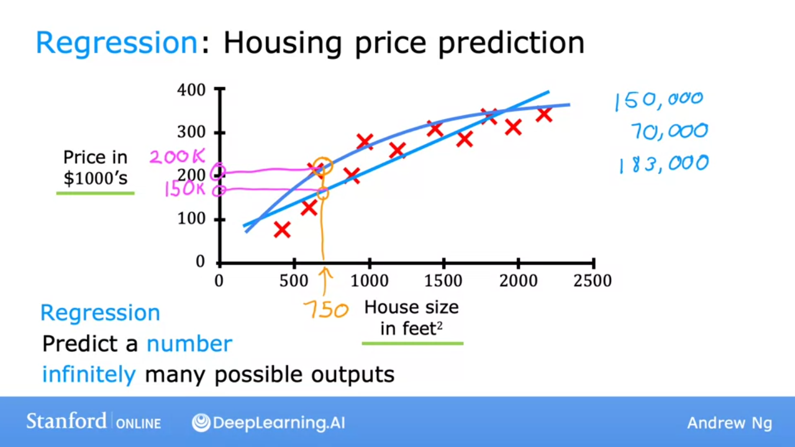
- We can use different algorithms to predict price of house based on data

### 3 Supervised Learning: Classification 

- #Regression attempts to predict infinite possible results
- #Classification predicts categories ie from limited possible results

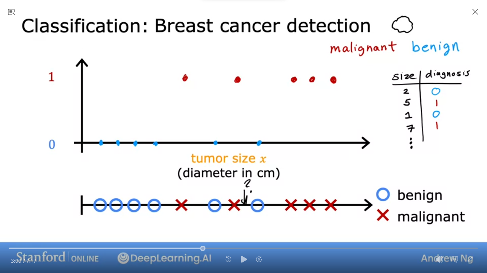

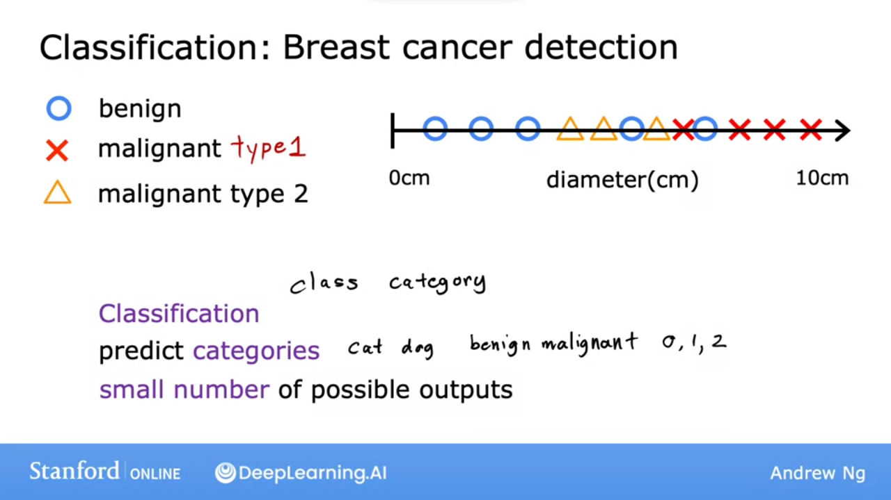
- we can have _multiple outputs_

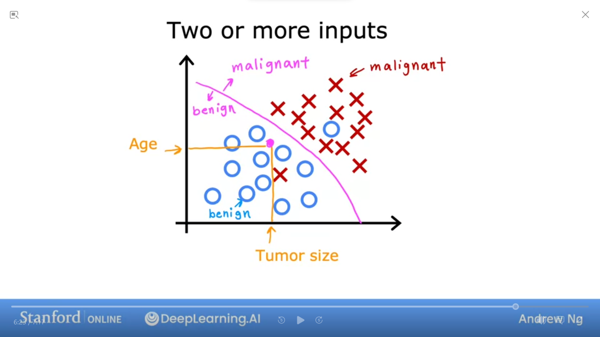
- we can draw a _boundary line_ to separate our output

|          | Regression | Classification |
| -        | -          | -              |
| Predicts | numbers    | categories     |
| Outputs  | infinite   | limited        |

### 4 Unsupervised Learning: Clustering, Anomaly Detection

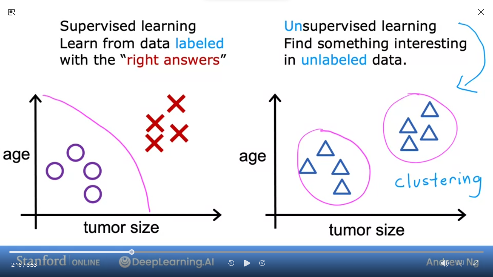
- With unsupervised we don't have predetermined expected output
- we're trying to find structure in the pattern, in this example _clustering_
- e.g. Google News will "cluster" news related to pandas given a specific article about panda/birth/twin/zoo

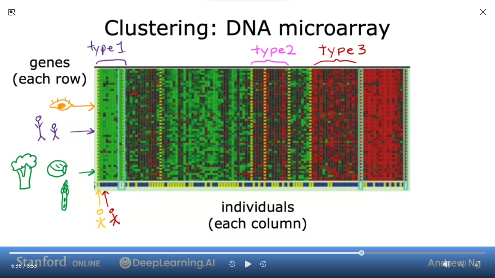
- e.g. given set of individual genes, _cluster_ similar genes

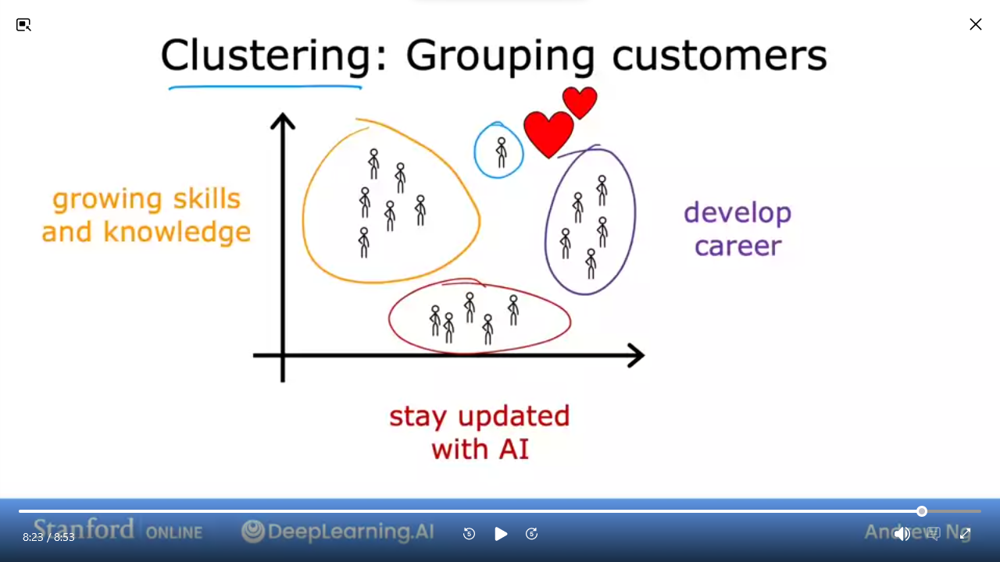
- e.g. how deeplearning.ai categorizes their learners

> #Unsupervised_Learning Data only comes with inputs x, but not output labels y. 
> Algorithm has to find _structure_ in the data
> - #Clustering Group similar data points together
> - #Anomaly_Detection Find unusual data points
> - #Dimensionality_Reduction Compress data using fewer numbers

#### Question: 

Of the following examples, which would you address using an unsupervised learning algorithm?  
(Check all that apply.)
- [ ] Given a set of news articles found on the web, group them into sets of articles about the same stories.
- [ ] Given email labeled as spam/not spam, learn a spam filter.
- [ ] Given a database of customer data, automatically discover market segments and group customers into different market segments.
- [ ] Given a dataset of patients diagnosed as either having diabetes or not, learn to classify new patients as having diabetes or not.

<details><summary>Ans</summary>1,3</details>

### Lab 01: Python and Jupyter Notebooks
Learn basics of Jupyter [Local: Jupyter Notebook](/code/C1_W1_Lab01_Python_Jupyter_Soln.ipynb)  || [Coursera Jupyter](https://www.coursera.org/learn/machine-learning/ungradedLab/rNe84/python-and-jupyter-notebooks/lab?path=%2Fnotebooks%2FC1_W1_Lab01_Python_Jupyter_Soln.ipynb) 

### Quiz: Supervised vs Unsupervised Learning

Which are the two common types of supervised learning (choose two)
- [ ] Classification
- [ ] Regression
- [ ] Clustering

Which of these is a type of unsupervised learning?
- [ ] Clustering
- [ ] Regression
- [ ] Classification

<details><summary>Ans</summary>
- 1,2
- 1
</details>

## Regression Model

### 1 Linear Regression Model 

> #Linear_Regression_Model => a *Supervised Learning Model* that simply puts a line through a dataset
- most commonly used model

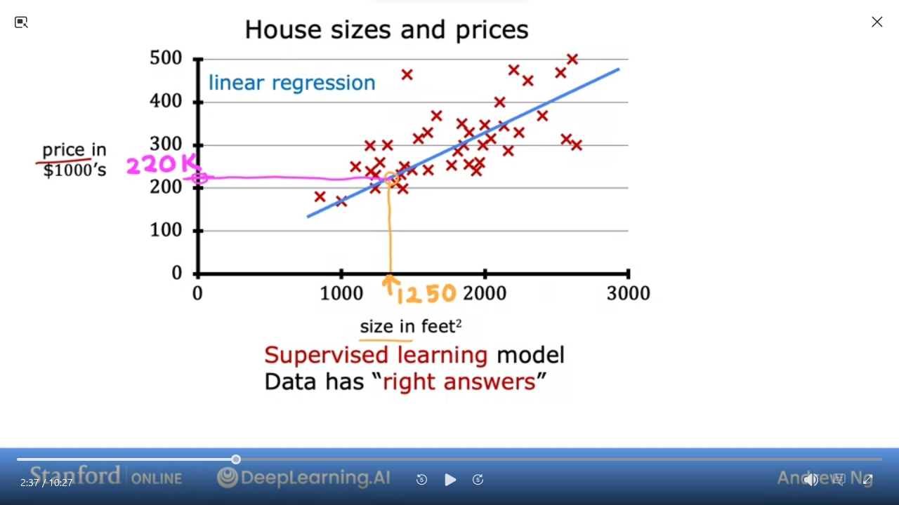
- e.g. Finding the right house price based on dataset of houses by sq ft.

|  Terminology |                              |
| -----------: | :--------------------------- |
| Training Set | data used to train the model |
|            x | input  or _#feature_         |
|            y | output variable or _#target_ |
|            m | number of training examples  |
|        (x,y) | single training example      |
|      (xⁱ,yⁱ) | i-th training example        |
`f` is a linear function with _one variable_
- $f_{w,b}(x) = wx + b$ is equivalent to 
- $f(x) = wx + b$

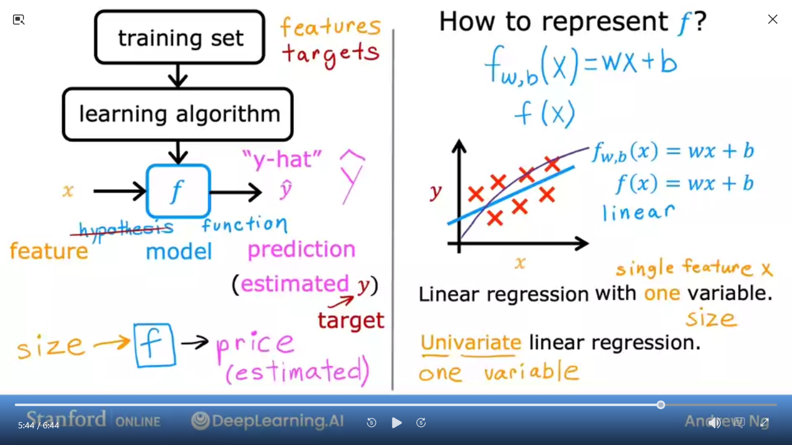
- _Univariate_ linear regression => one variable

### Lab 02: Model representation
[Coursera Jupyter: Model representation](https://www.coursera.org/learn/machine-learning/ungradedLab/PhN1X/optional-lab-model-representation/lab) || [Local Jupyter](/code/C1_W1_Lab02_Model_Representation_Soln.ipynb)

In this lab you will learn:
 - Linear regression builds a model which establishes a relationship between features and targets
- In the example, the feature was house size and the target was house price
- For simple linear regression, the model has two parameters $w$ and $b$ whose values are _fit_ using *training data*.
- Once a model's parameters have been determined, the model can be used to make predictions on novel data.

|                     | Python      | Description                                                                                                              |
| :------------------ | :---------- | :----------------------------------------------------------------------------------------------------------------------- |
| $\mathbf{x}$        | `x_train`   | Training Example feature values (in this lab - Size (1000 sqft))                                                         |
| $\mathbf{y}$        | `y_train`   | Training Example  targets (in this lab Price (1000s of dollars))                                                         |
| $x^{(i)}$,$y^{(i)}$ | `x_i`,`y_i` | $i_{th}$Training Example                                                                                                 |
| m                   | `m`         | Number of training _examples_                                                                                            |
| $w$                 | `w`         | parameter: _#weight_ (_slope_)                                                                                           |
| $b$                 | `b`         | parameter: _#bias_ (_y-intersect_)                                                                                       |
| $f_{w,b}(x^{(i)})$  | `f_wb`      | _#Model_Function_ The result of the model evaluation at $x^{(i)}$ parameterized by `w,b` $f_{w,b}(x^{(i)}) = wx^{(i)}+b$ |
Code
- `NumPy`, a popular library for scientific computing
- `Matplotlib`, a popular library for plotting data
  - `scatter()` to plot on a graph
    - `marker` for symbol to use
    - `c` for color

Goal is to find the `w, b` to give you best fit line through your data
```python
import numpy as np                       # https://numpy.org/ for mathematical calculations
import matplotlib.pyplot as plt          # https://matplotlib.org package for 2D graphs
plt.style.use('./deeplearning.mplstyle') # matplotlib style sheet

x_train = np.array([1.0, 2.0])      # x_train is the input (size in 1000 square feet)
y_train = np.array([300.0, 500.0])  # y_train is target (price in 1000s of dollars)

def compute_model_output(x, w, b):      # Computes the prediction of a linear model
  m = x_train.shape[0]                  # `.shape[0]` returns the number of rows 
  f_wb = np.zeros(m)                    # return 1-dim array of zeros
  for i in range(m):
    f_wb[i] = w * x[i] + b              # compute the model output
  return f_wb

w = 200; b = 100;       # w = weight, b = bias; These are the params you can modify
tmp_f_wb = compute_model_output(x_train, w, b)

plt.plot(x_train, tmp_f_wb, c='blue',label='Our Prediction') # Plot our prediction
plt.scatter(x_train, y_train, marker='x', c='red',label='Actual Values') 
plt.title("Housing Prices")                                  # Set the title
plt.ylabel('Price (in 1000s of dollars)')                    # Set the y-axis label
plt.xlabel('Size (1000 sqft)')                               # Set the x-axis label
plt.legend(); plt.show()
```

### 4 Cost function formula

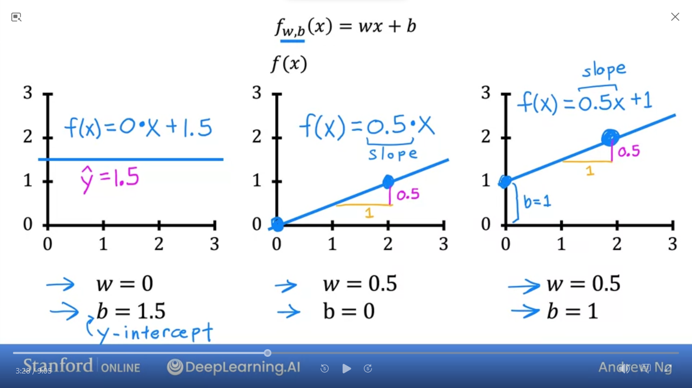
- We can play with `w` & `b` to find the best fit line

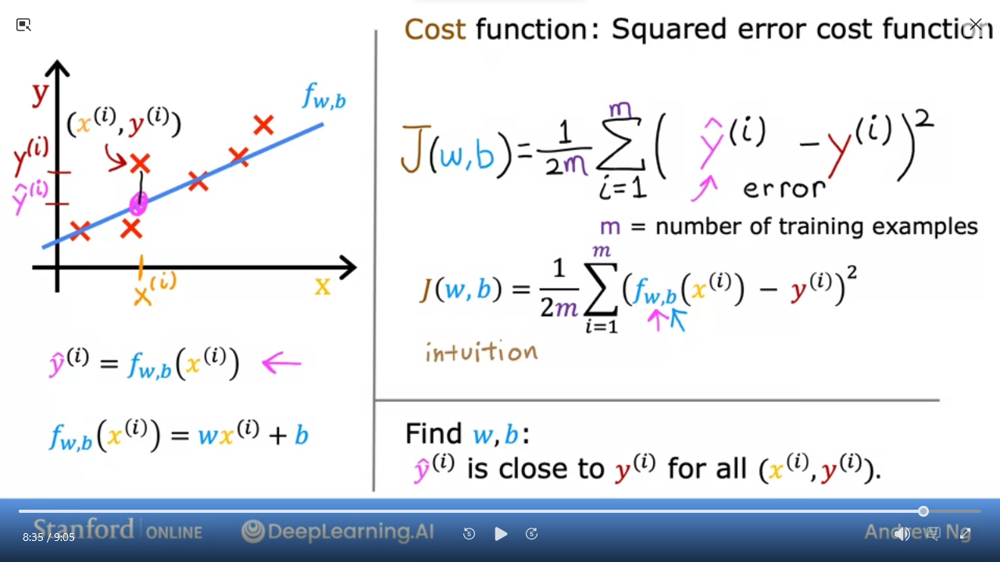
> #Cost_Function is a formula that measures the difference between predicted and actual values, aiming to minimize the error between them. It serves as a _performance metric for evaluating a model’s fitness_ .
- 1st step to_implement linear function is to define _Cost_Function_
-  Given $f_{w,b}(x) = wx + b$ where `w` is the #slope and `b` is the #y-intercept
- `Cost function` takes  predicted $\hat{y}$ and compares to `y`
- ie `error` = $\hat{y} - y$
- $\sum\limits_{i=1}^{m} (\hat{y}^{(i)} - y^{(i)})^{2}$ where `m` is the number of training examples
- Dividing by `2m` makes the calculation neater $\frac{1}{2m} \sum\limits_{i=1}^{m} (\hat{y}^{(i)} - y^{(i)})^{2}$
- Also known as _#squared_error_cost_function_ $J_{(w,b)} = \frac{1}{2m} \sum\limits_{i=1}^{m} (\hat{y}^{(i)} - y^{(i)})^{2}$
- Which can be rewritten as $J_{(w,b)} = \frac{1}{2m} \sum\limits_{i=1}^{m} (f_{w,b}(x^{(i)}) - y^{(i)})^{2}$
- Remember we want to find values of `w,b` where $\hat{y}^{(i)}$ is close to $y^{(i)}$ for all $(x^{(i)}, y^{(i)})$

#### Question: 

Which of these parameters of the model that can be adjusted?
-$w$ and $b$
-$f_{w,b}$
-$w$ only, because we should choose $b = 0$
-$\hat{y}$

<details><summary>Ans</summary>1</details>

### 5 Cost Function Intuition

To get a sense of how to minimize $J$ we can use a simplified model

|               |                                                                                   | simplified                                                                    |
| ------------- | --------------------------------------------------------------------------------- | ----------------------------------------------------------------------------- |
| model         | $f_{w,b}(x) = wx + b$                                                             | $f_{w}(x) = wx$ by setting $b=0$                                              |
| parameters    | $w, b$                                                                            | $w$                                                                           |
| cost function | $J_{(w,b)} = \frac{1}{2m} \sum\limits_{i=1}^{m} (f_{w,b}(x^{(i)}) - y^{(i)})^{2}$ | $J_{(w)} = \frac{1}{2m} \sum\limits_{i=1}^{m} (f_{w}(x^{(i)}) - y^{(i)})^{2}$ |
| goal          | we want to minimize$J_{(w,b)}$                                                    | we want to minimize$J_{(w)}$                                                  |

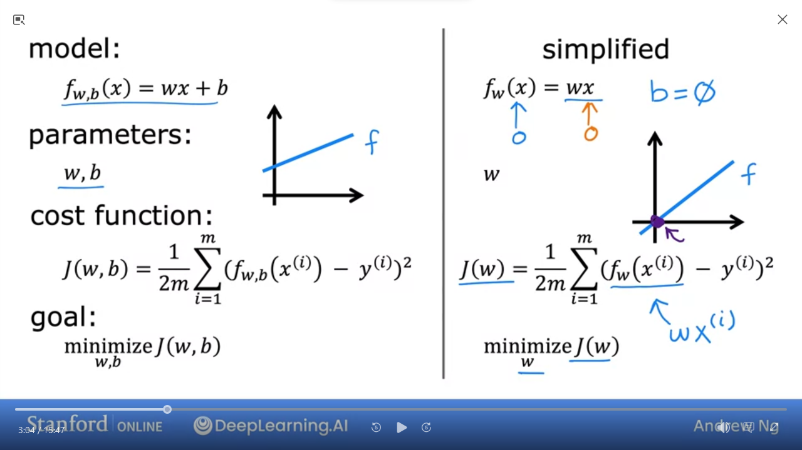
- we can use simplified function to find the best fit line 

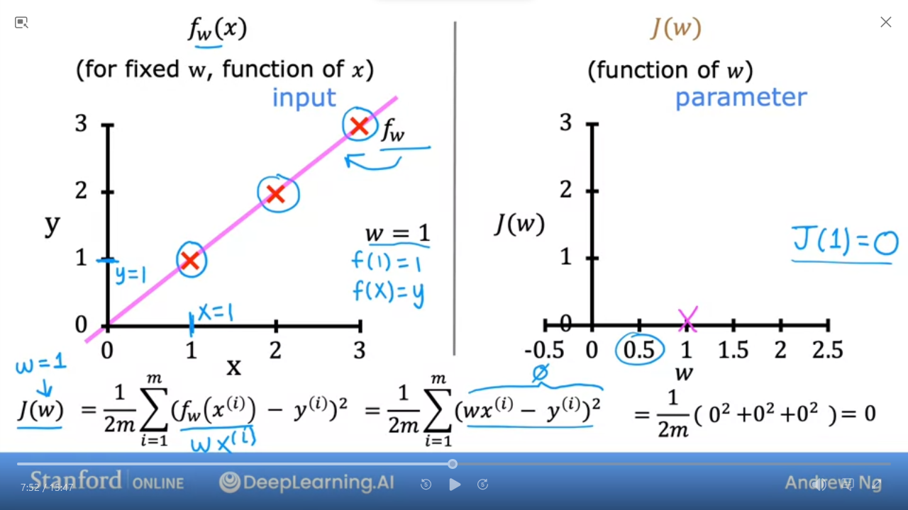
- the 2nd graph shows that when $w = 1$ then $J(1) = 0$

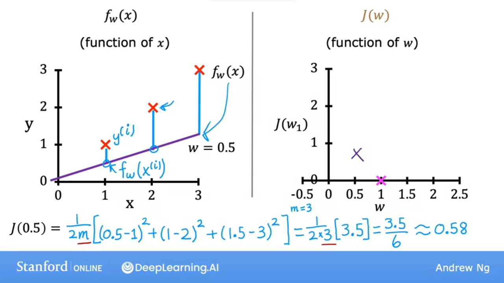
- the 2nd graph shows that when $w = 0.5$ then $J(0.5) ~= 0.58$

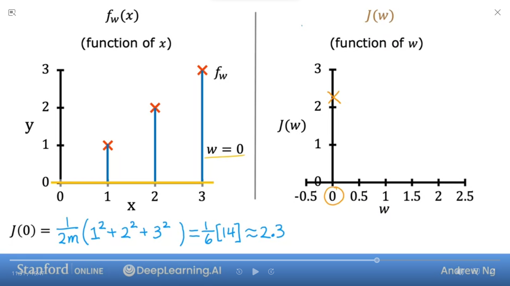
- the 2nd graph shows that when $w = 0$ then $J(0) \approx 2.33$

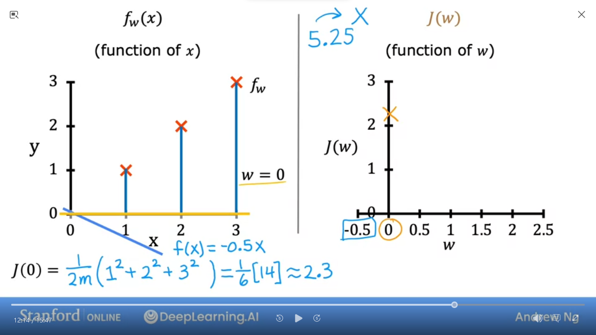
- We can do this calculation for various $w$ even negative numbers
- when $w = -0.5$ then $J(-0.5) \approx 5.25$

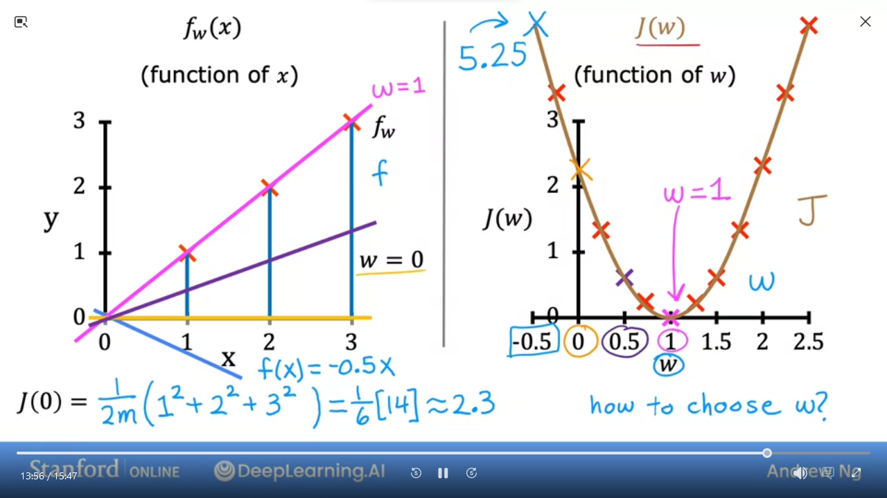
- We can plot various values for `w` and get a graph (on the right)
- As we can see the cost function with $w = 1$ is the best fit line for _this data_

> 💡 The goal of linear regression is to find the values of $w,b$ that allows us to minimize $J_{(w,b)}$

### 6 Visualizing the cost function

|               |                                                                                   |
| ------------- | --------------------------------------------------------------------------------- |
| model         | $f_{w,b}(x) = wx + b $``$                                                         |
| parameters    | $w$,$b$                                                                           |
| cost function | $J_{(w,b)} = \frac{1}{2m} \sum\limits_{i=1}^{m} (f_{w,b}(x^{(i)}) - y^{(i)})^{2}$ |
| goal          | minimize$J_{(w,b)}$                                                               |

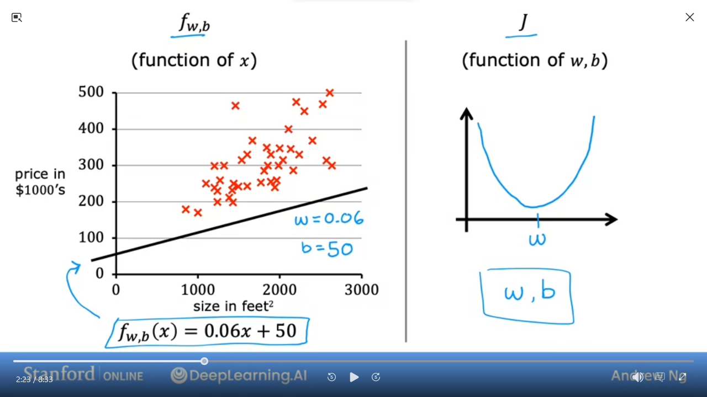
- When we only have w, then we can plot `J` vs `w` in 2-dimensions

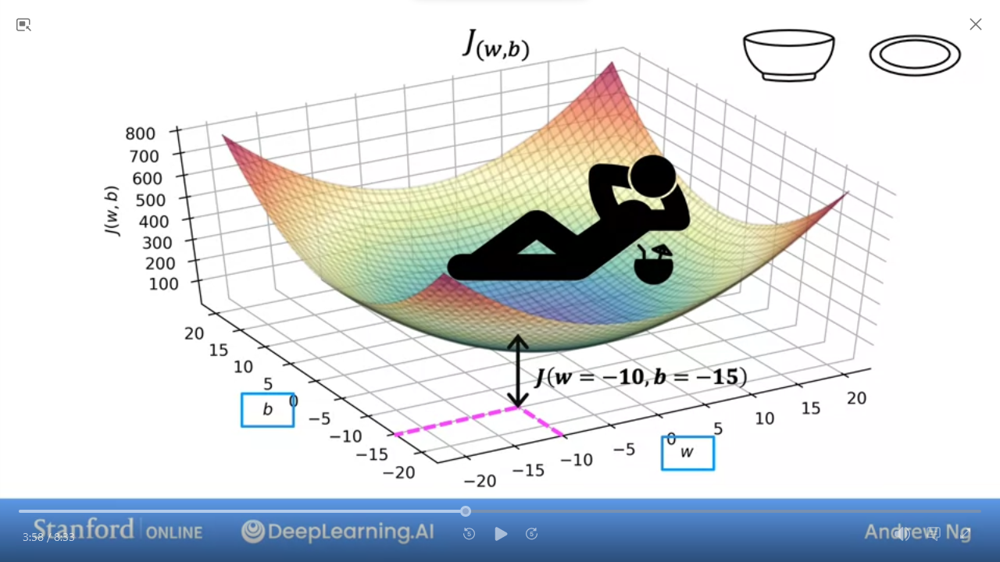
- However, when we add `b` then it's 3-dimensional
- The value of `J` is the height

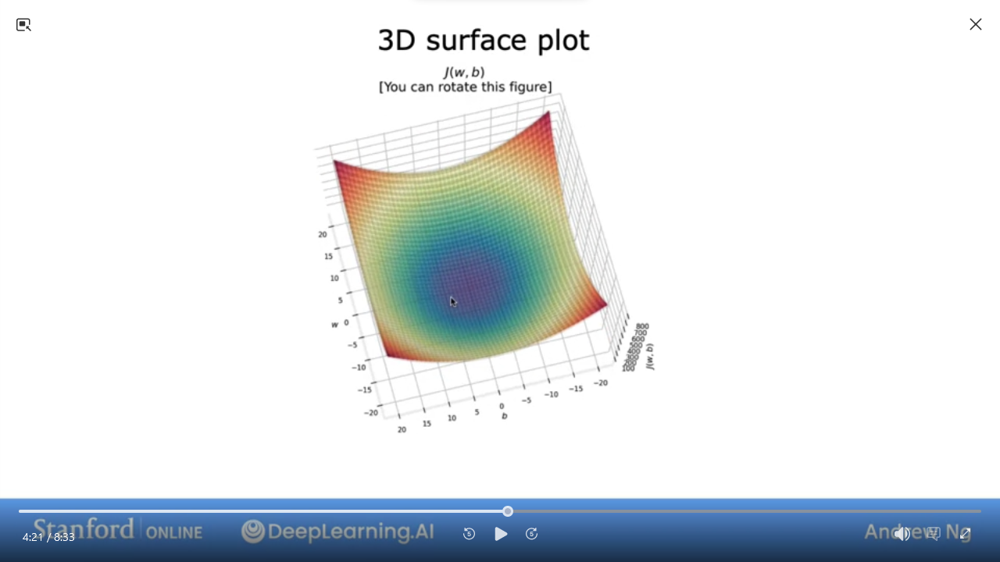
- this is easier to visualize as a `contour plot`

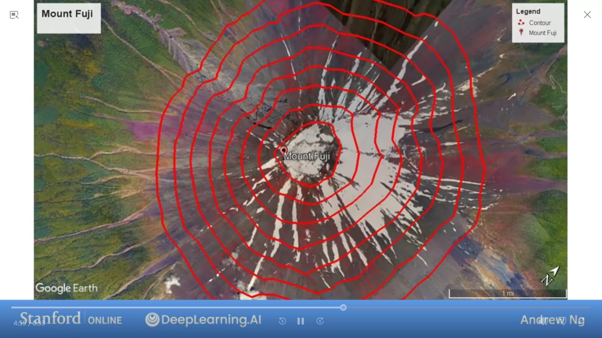
- Same as used to visualize height of mountains

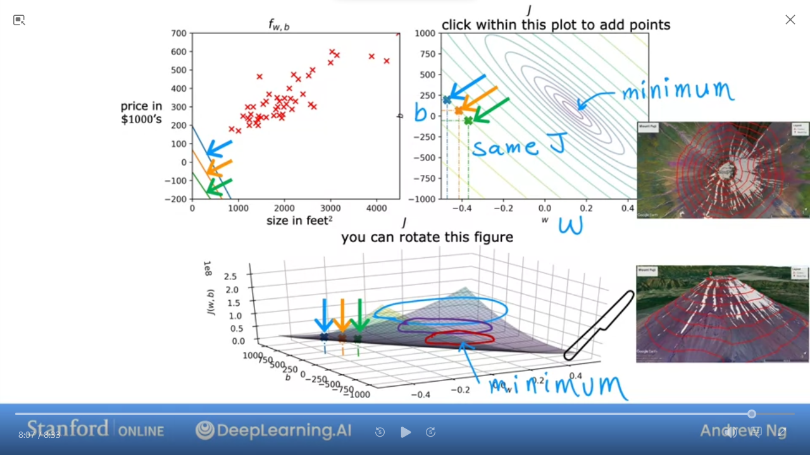
- take a horizontal slice which gives you the same `J` for given `w,b`
- the center of the contour is the minimum
- #Countour allows us to visualize the 3-D `J` in 2-D

### 7 Visualization examples

Here are some examples of `J`

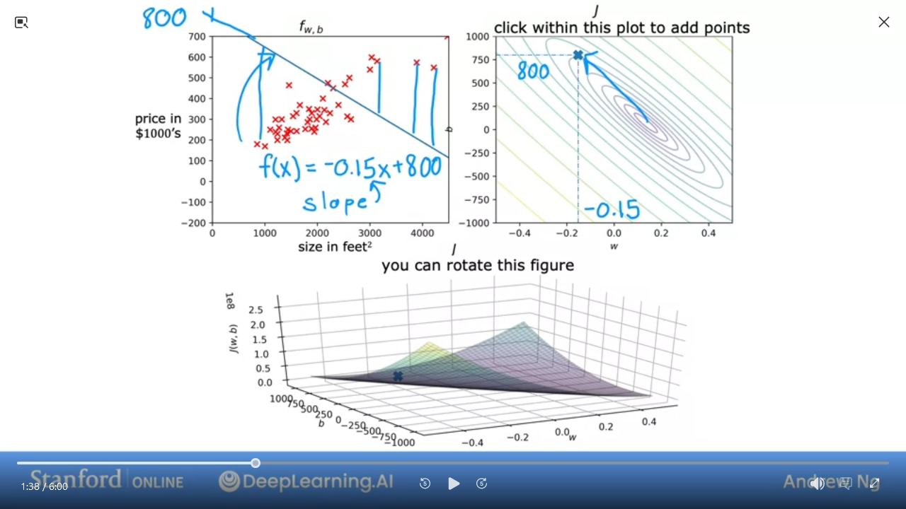
- We can see this is a pretty bad `J`

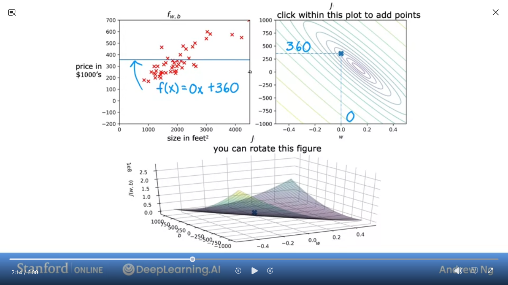

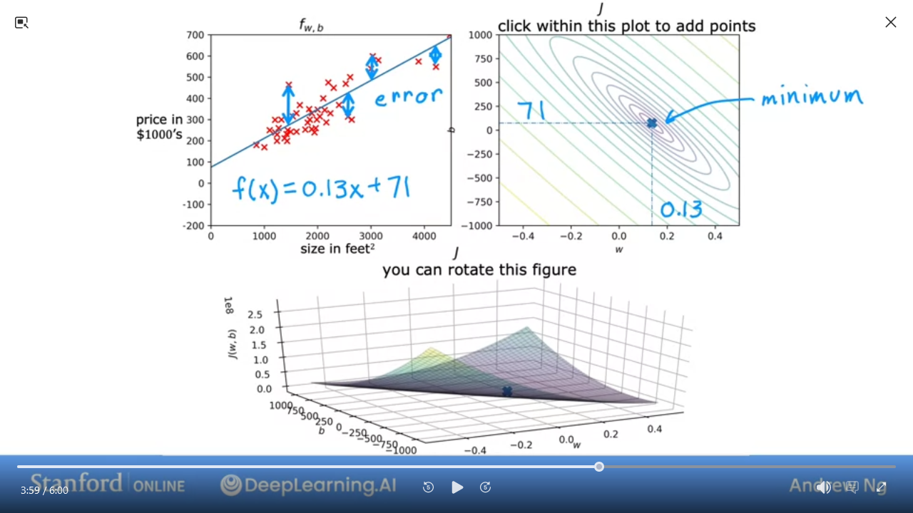
- This is pretty good and close to minimal (but not quite perfect)

In the next lab, you can click on different points on the contour to view the cost function on the graph

> #Gradient_Descent is an algorithm to train linear regression and other complex models 

#### Lab 03: Cost function

[Coursera Jupyter: Cost Function](https://www.coursera.org/learn/machine-learning/ungradedLab/udPHh/optional-lab-cost-function/lab?path=%2Fnotebooks%2FC1_W1_Lab03_Cost_function_Soln.ipynb)  ||  [Local: Cost Function](/code/C1_W1_Lab03_Cost_function_Soln.ipynb)
- implement and explore the `cost` function for linear regression with one variable. 
```python
# Cost Function
cost_sum = 0 
for i in range(m): 
    f_wb = w * x[i] + b   
    cost = (f_wb - y[i]) ** 2  
    cost_sum = cost_sum + cost  
total_cost = (1 / (2 * m)) * cost_sum 
```

#### Quiz: Regression Model

1. Which of the following are the inputs, or features, that are fed into the model and with which the model is expected to make a prediction?
- [ ] $m$
- [ ] $w$ and $b$
- [ ] $(x,y)$
- [ ] $x$

2. For linear regression, if you find parameters$w$and$b$so that$J_{(w,b)}$is very close to zero, what can you conclude?
- [ ] The selected values of the parameters$w, b$cause the algorithm to fit the training set really well
- [ ] This is never possible. There must be a bug in the code
- [ ] The selected values of the parameters$w, b$cause the algorithm to fit the training set really poorly

<details><summary>Ans</summary>4, 1</details>

## Train the model with gradient descent
### 1 Gradient descent

Want a systematic way to find values of$w,b$that allows us to easily find smallest $J$

> #Gradient_Descent is an algorithm used for any function, not just in linear regression but also in advanced neural network models


- start with some$w,b$e.g. $(0,0)$
- keep changing$w,b$to reduce $J(w,b)$
- until we settle at or near a minimum


- Example of a more complex $J$ that is not a squared error cost nor linear regression
- we want to get to the lowest point in this topography
- pick a direction and take a step that is slightly lower, and repeat until you're at lowest point
- However, depending on starting point and direction, you will end up at a different "lowest point"
  - Known as #local_mimina

> #local_minima may not be the true lowest point

### 2 Implementing gradient descent


- The `Gradient Descent` algorithm
- $w = w - \alpha \frac{\partial}{\partial w} J_{(w,b)}$
  -$\alpha$== #learning_rate ie How "big a step" you take down the hill
  -$\frac{\partial}{\partial w} J_{(w,b)}$== #derivative ie which direction
-$b = b - \alpha \frac{\partial}{\partial b} J_{(w,b)}$
- We repeat these 2 steps for$w,b$until the algorithm __converges__
  - ie each subsequent step doesn't change the value
- We want to _simultaneously_ update w and b at each step
  - `tmp_w` = $w - \alpha \frac{\partial}{\partial w} J_{(w,b)}$
  - `tmp_b` = $b - \alpha \frac{\partial}{\partial b} J_{(w,b)}$
  - `w = tmp_w && b = tmp_b`

### 3 Gradient descent intuition


- We want to find minimum `w,b`

$$
\begin{aligned}
\text{repeat until convergence \{} \\ 
  &w = w - \alpha \frac{\partial}{\partial w} J_{(w,b)}\\
  &b = b - \alpha \frac{\partial}{\partial b} J_{(w,b)}\\
\}
\end{aligned}
$$

- Starting with finding `min w` we can simplify to just $J(w)$
- Gradient descent with$w = w - \alpha \frac{\partial}{\partial w} J_{(w)}$
- minimize cost by adjusting just `w`:$\min J(w)$


- Recall previous example where we set `b = 0`
- Initialize `w` at a random location
-$\frac{\partial}{\partial w} J(w)$is the __slope__
  - we want to find slopes __that take us to minimum w__
- In the first case, we get$w - \alpha (positive number)$which is the correct direction
- However (_2nd graph_), slope is negative, and therefore also in the correct direction

### 4 Learning rate


-$\alpha$is the __learning rate__ ie how big a step to take
  - If _too small_ then you take small steps and will take a long time to find minimum
  - If _too big_ then you might miss true minimum ie __diverge__ instead of _converge_


- If you're already at local minimum...
- `slope = 0` and therefore$\frac{\partial}{\partial w} J(w) = 0$
  - ie `w = w * 0`
  - further _steps_ will bring you back here


- As we get closer to local minimum, gradient descent (_derivative function_) will __automatically take smaller steps__

### 5 Gradient descent for linear regression


- #linear_regression_model    $f_{w,b}(x) = wx + b$
- #cost_function              $J_{(w,b)} = \frac{1}{2m} \sum\limits_{i=1}^{m} (f_{w,b}(x^{(i)} - y^{(i)})^{2}$
- #gradient_descent_algorithm  

$$
\begin{aligned}
\text{repeat until convergence \{} \\ 
  &w = w - \alpha \frac{\partial}{\partial w} J_{(w,b)}\\
  &b = b - \alpha \frac{\partial}{\partial b} J_{(w,b)}\\
\}
\end{aligned}
$$
- where$\frac{\partial}{\partial w} J_{(w,b)}$=$\frac{1}{m} \sum\limits_{i=1}^{m} (f_{w,b}(x^{(i)} - y^{(i)})x^{(i)}$
- and$\frac{\partial}{\partial b} J_{(w,b)}$=$\frac{1}{m} \sum\limits_{i=1}^{m} (f_{w,b}(x^{(i)} - y^{(i)})$


- We can simplify for `w`

$$
\begin{align}
\frac{\partial}{\partial w} J_{(w,b)} \\
&= \frac{\partial}{\partial w} \frac{1}{2m} \sum\limits_{i=1}^{m} (f_{w,b}(x^{(i)} - y^{(i)})^2 \\
&= \frac{\partial}{\partial w} \frac{1}{2m} \sum\limits_{i=1}^{m} (wx^{(i)} + b - y^{(i)})^2 \\
&= \frac{1}{2m} \sum\limits_{i=1}^{m} (wx^{(i)} + b - y^{(i)}) 2x^{(i)} \\
&= \frac{1}{m} \sum\limits_{i=1}^{m} (wx^{(i)} + b - y^{(i)}) x^{(i)} \\
&= \frac{1}{m} \sum\limits_{i=1}^{m} ((f_{w,b}(x^{(i)}) - y^{(i)}) x^{(i)}
\end{align}
$$

- and for `b`

$$
\begin{align}
\frac{\partial}{\partial b} J_{(w,b)} \\
&= \frac{\partial}{\partial b} \frac{1}{2m} \sum\limits_{i=1}^{m} (f_{w,b}(x^{(i)} - y^{(i)})^2 \\
&= \frac{\partial}{\partial b} \frac{1}{2m} \sum\limits_{i=1}^{m} (wx^{(i)} + b - y^{(i)})^2 \\
&= \frac{1}{2m} \sum\limits_{i=1}^{m} (wx^{(i)} + b - y^{(i)}) 2 \\
&= \frac{1}{m} \sum\limits_{i=1}^{m} (wx^{(i)} + b - y^{(i)}) \\
&= \frac{1}{m} \sum\limits_{i=1}^{m} ((f_{w,b}(x^{(i)}) - y^{(i)})
\end{align}
$$

 

 
- a __convex function__ will have a _single global minimum_

### 6 Running gradient descent

 
- left is _plot of the model_
- right is #contour_plot of the cost function
- bottom is the #surface_plot of the cost function
- for this example, `w = -0.1`, `b = 900`
- as we take each step we get closer to the global minimum
  - the yellow line is the __best line fit__
- Given a house with `1250 sq ft`, we can predict it should sell for  `$250k per the model`

 
- __Batch Gradient Descent__ => each step of the gradient descent uses _all the training examples_
- DeepLearning.AI newsletter: _The Batch_
_test_ __bold__

#### Lab 04: Gradient descent

[Coursera Jupyter: Gradient descent](https://www.coursera.org/learn/machine-learning/ungradedLab/lE1al/optional-lab-gradient-descent/lab) || [Local: Gradient Descent](/code/C1_W1_Lab04_Gradient_Descent_Soln.ipynb)
- In this lab you:
  - delved into the details of gradient descent for a single variable.
  - developed a routine to compute the gradient
  - visualized what the gradient is
  - completed a gradient descent routine
  - utilized gradient descent to find parameters
  - examined the impact of sizing the learning rate

#### Quiz: Train the Model with Gradient Descent

1. Gradient descent is an algorithm for finding values of parameters w and b that minimize the cost function $J$.
$$
\begin{aligned}
\text{repeat until convergence \{} \\ 
  &w = w - \alpha \frac{\partial}{\partial w} J_{(w,b)}\\
  &b = b - \alpha \frac{\partial}{\partial b} J_{(w,b)}\\
\}
\end{aligned}
$$
`testing code`
When $\frac{\partial}{\partial w} J_{(w,b)}$ is a negative number, what happens to `w` after one update step?
- [ ] It is not possible to tell is `w` will increase or decrease
- [ ] w increases
- [ ] w stays the same
- [ ] w decreases 

2. For linear regression, what is the update step for parameter b?
- [ ] $b = b - \alpha \frac{1}{m} \sum\limits_{i=1}^{m} ((f_{w,b}(x^{(i)}) - y^{(i)})$
- [ ] $b = b - \alpha \frac{1}{m} \sum\limits_{i=1}^{m} ((f_{w,b}(x^{(i)}) - y^{(i)}) x^{(i)}$

<details><summary>Ans</summary>2, 2</details>
